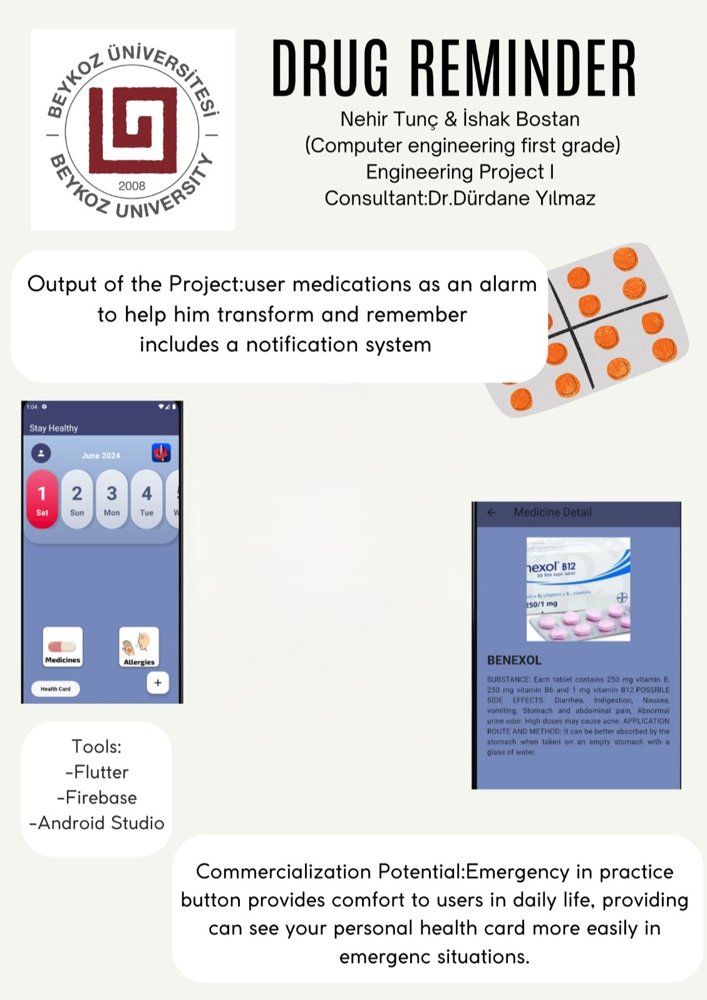
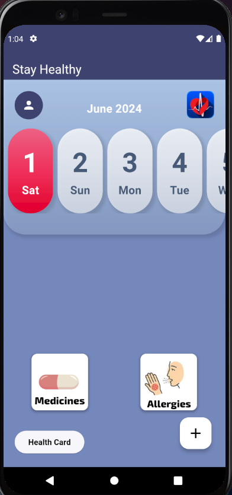
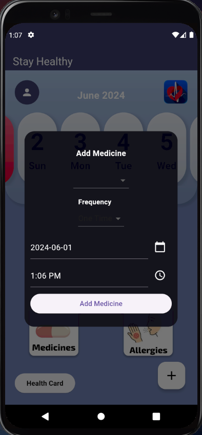
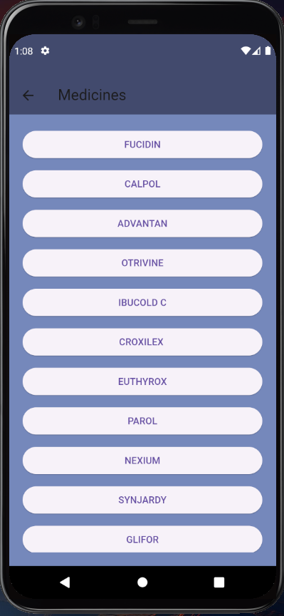
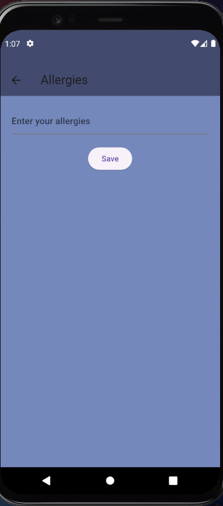
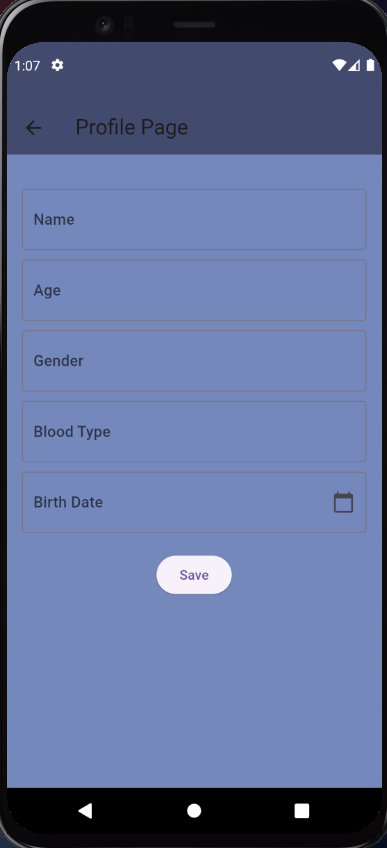
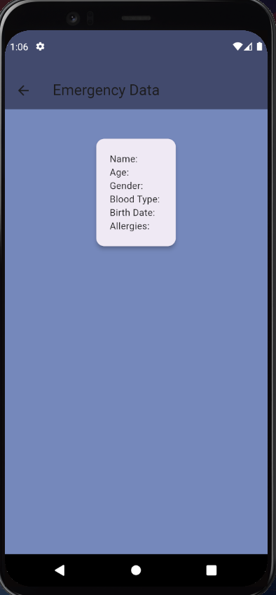

# 💊 Pill Reminder (İlaç ve Sağlık Takip Uygulaması)

**Pill Reminder**, bireylerin günlük ilaç kullanımlarını düzenli bir şekilde takip etmelerini, sağlık verilerini güvenle saklamalarını ve acil durumlarda kritik bilgilere anında erişilmesini sağlayan kapsamlı bir mobil sağlık asistanıdır.

Bu proje, Beykoz Üniversitesi Bilgisayar Mühendisliği bölümü öğrencileri **Nehir Tunç** ve **İshak Bostan** tarafından, **Dr. Dürdane Yılmaz** danışmanlığında *Mühendislik Projesi I* kapsamında geliştirilmiştir.

## 🎯 Projenin Amacı ve Çözdüğü Sorunlar

Günümüzde kronik rahatsızlıkları olan veya düzenli ilaç kullanması gereken kişilerin en büyük sorunlarından biri doz atlamaktır. Pill Reminder, kullanıcıların ilaçlarını doğru zamanda almasını sağlayarak tedavi süreçlerini iyileştirmeyi hedefler. 

Buna ek olarak, acil bir tıbbi müdahale anında kişinin bilinci kapalı olsa dahi; sağlık personelinin hastanın kan grubu, yaş, kronik rahatsızlıkları ve alerjileri gibi hayati bilgilere saniyeler içinde ulaşabilmesi için özel bir **"Acil Durum Kartı (Emergency Data)"** altyapısı sunar.

## 💻 Kullanılan Teknolojiler ve Mimari

Uygulama, modern mobil geliştirme standartlarına uygun olarak tasarlanmış ve verilerin güvenli bir şekilde yönetilmesi sağlanmıştır:

* **Geliştirme Dili ve Çerçevesi (Frontend):** Uygulamanın kullanıcı arayüzü ve temel mantığı **Flutter** (Dart dili) kullanılarak kodlanmıştır. Bu sayede hem Android hem de iOS platformlarında yüksek performanslı, akıcı ve tutarlı bir kullanıcı deneyimi hedeflenmiştir.
* **Veritabanı ve Bulut Mimarisi (Backend):** Uygulama içindeki tüm kritik veriler (Kullanıcı profilleri, ilaç saatleri, alerji listeleri ve acil durum verileri) **Firebase** ile entegre çalışarak anlık olarak buluta kaydedilir. Verilerin Firebase üzerinde tutulması sayesinde cihaz değişikliği veya uygulamanın silinmesi durumunda veri kaybı yaşanmaz.
* **Geliştirme Ortamı:** Proje geliştirme süreçlerinde IDE olarak Android Studio ve Visual Studio Code kullanılmıştır.

## ✨ Temel Özellikler

* **Dinamik İlaç Takvimi:** Ana ekran üzerinden seçilen güne ait kullanılması gereken ilaçlar listelenir.
* **Özelleştirilebilir Hatırlatıcılar:** İlaçların frekansına (tek seferlik, günlük vb.) ve saatine göre kayıt oluşturma sistemi.
* **Alerji ve Profil Kaydı:** Kullanıcının temel sağlık ve demografik bilgileri Firebase'e işlenerek kalıcı ve güncellenebilir hale getirilir.
* **Tek Tıkla Acil Durum Kartı:** Kriz anlarında karmaşık menülerde boğulmadan, tek bir butonla en hayati verilere doğrudan erişim ekranı.

## 📱 Ekran Görüntüleri ve Arayüz

*(Görselleri orijinal boyutunda incelemek için üzerlerine tıklayabilirsiniz)*

| Proje Posteri | Ana Ekran | İlaç Ekleme | İlaç Listesi |
|:---:|:---:|:---:|:---:|
|  |  |  |  |

| Alerji Girişi | Profil Sayfası | Acil Durum Kartı |
|:---:|:---:|:---:|
|  |  |  | 

---
*Bu proje Beykoz Üniversitesi Mühendislik Projesi I dersi kapsamında eğitim amaçlı geliştirilmiştir.*
